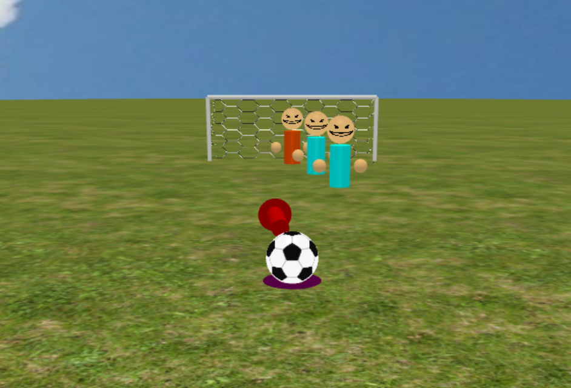

# Soccer Shootout

Soccer Shootout is a 3D game where players must shoot penalty kicks against
ever-increasing odds. It is our final project for UCLA's CS 174A class. Check
out the game on [our webpage](https://prestonrooker.github.io/SoccerShootout)!



## How to play

Aim the ball and shoot when you're ready. Watch for the power circle - a bigger
circle means your shot will have more speed. Aim for the goal around the
defenders and obstacles. Score goals to rack up points! Miss more than 3 times
in a level and it's game over.

### Controls

| Key          | Action       |
| ------------ | ------------ |
| Arrow keys   | Aim the ball |
| Enter/Return | Shoot        |

## Running locally

1. Clone the project
```
git clone https://github.com/PrestonRooker/SoccerShootout.git
cd SoccerShootout
```
2. On Windows, run `.\host.bat`. On Unix, run `./host.command`.
3. Navigate to https://localhost:8000.

## Key features

#### Ball dynamics and friction
The soccer ball's motion is modeled using kinematic equations and experiences
negative y-acceleration. When the ball is kicked, it is given an initial
velocity and angle based on shot power and aim. While it is rolling on the
ground, the ball experiences deceleration against the direction of motion. We
also simulate rolling of the ball based on its x- and z-velocity.

#### Collision detection and resolution
The ball collides with the ground, obstacles and defenders. We model each object
with a collider; for each face on the collider, we check if it contacts the
ball, and if so a collision is generated. To resolve collisions, we reflect the
velocity of the ball against the vector of collision, reducing its momentum due
to inelasticity. To ensure accurate collisions, the ball's motion is updated
several times per frame.

#### Leveling system
The leveling system is comprised of the number and types of obstacles that a
player will face. Each time a goal is scored a new obstacle is added to the
overall collection of obstacles in their path. This allows for the game to have
scaling difficulty as they player proceeds through the levels. If a player
misses 4 times in a level, they are forced back to the first level and must
climb again.

#### Shadowing
To achieve shadowing, we do two passes when drawing every object. The first pass
draws the object itself and the second pass draws a secondary shadow object next
to the first. In order to determine the size and shape, a shader is implemented
which takes in the position of an object relative to the position of an
individual light source and calculates the size and shape of the shadow which
morphs as the light moves.

#### Audio and visual feedback
We used collision-triggered audio along with an epic soundtrack to immerse
players in the game. Players can also see the current state of the game, like
points or lives, through a HUD and receive visual feedback when they score.

## Attributions

- Soccer icon created by [Roundicons - Flaticon](https://www.flaticon.com/free-icons/soccer)
