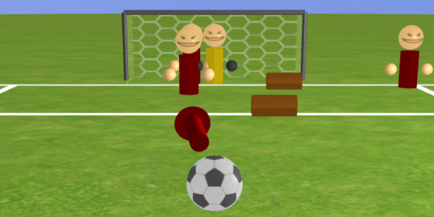

# Soccer Shootout

Soccer Shootout is a 3D game where players must shoot penalty kicks against
ever-increasing odds. It is our final project for UCLA's CS 174A class. Check
out the game on [our webpage](https://prestonrooker.github.io/SoccerShootout)!



## How to play

Aim the ball and shoot when you're ready. Watch for the power circle - a bigger
circle means your shot will have more speed. Aim for the goal around the
defenders and obstacles. Score goals to rack up points! Miss more than 3 times
in a level and it's game over.

### Controls

| Key          | Action       |
| ------------ | ------------ |
| Arrow keys   | Aim the ball |
| Enter/Return | Shoot        |

## Running locally

1. Clone the project
```
git clone https://github.com/PrestonRooker/SoccerShootout.git
cd SoccerShootout
```
2. On Windows, run `.\host.bat`. On Unix, run `./host.command`.
3. Navigate to https://localhost:8000.

## Key features

- Texture mapping
- Level system
- 3D ball physics
  - Dynamics
  - Friction
  - Collision detection and resolution
- Shadowing

## Attributions

- Soccer icon created by [Roundicons - Flaticon](https://www.flaticon.com/free-icons/soccer)
